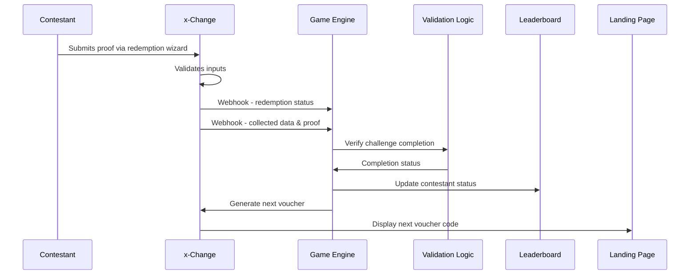

# Game Mechanics: Player Journey

---

## Player Journey Overview

The QuestPay™ player experience follows a carefully designed cycle that combines physical exploration, digital transactions, and competitive strategy.

---

## Sample Player Flow

### Step 1: Receive QuestPay Voucher Code

**Voucher Generation Triggered By**:
- Completing previous challenge
- Initial registration/sign-up
- Marketing CTA click
- Scheduled game event
- Producer action

**Delivery Method**: Voucher code (with optional QR) via:
- **SMS** (primary method)
- Email with embedded code
- Physical card with voucher number

**Voucher Contains**:
- Unique redemption code
- Expiration timestamp
- Challenge identifier
- Redemption URL

### Step 2: Complete the Mission

**Transaction Types**:

| Type | Example | Proof Required |
|------|---------|--------------|
| **Purchase** | Buy specific item from merchant | Receipt photo |
| **Bill Payment** | Pay utility or service bill | Payment reference |
| **Donation** | Contribute to charity | Receipt + transaction ID |
| **Transfer** | Send money to someone | Transaction screenshot |
| **Top-Up** | Add load or credits | Confirmation code |
| **Location Visit** | Check-in at specific place | GPS + photo |
| **Task Completion** | Solve puzzle, watch video | Screenshot/answer |

**Challenge Variations**:
- Simple: Single transaction at known location
- Moderate: Multiple steps or budget constraints
- Complex: Strategy required, multiple locations, time pressure

### Step 3: Redeem Voucher with Proof

**x-Change Redemption Flow**:

1. **Contestant clicks voucher link or enters code**
2. **x-Change validates** the code and logs redemption attempt
3. **Splash page displays** with challenge recap and branding
4. **Redemption wizard launches** - contestant MUST complete to redeem:
   - Upload receipt photo or proof
   - Submit location check-in (GPS coordinates)
   - Enter text responses or survey answers
   - Capture digital signature if required
   - Provide KYC data if needed
   - Answer verification questions
5. **x-Change validates inputs** in real-time
6. **Upon successful redemption**, contestant redirected to landing page

**Redemption Wizard Features**:
- Step-by-step guided input collection
- Photo/video upload with preview
- GPS location capture with map
- Digital signature pad
- Real-time validation feedback
- Cannot proceed without completing required fields

### Step 4: Game Operator Receives Feedback

**x-Change Webhook Notifications to Game Engine**:

**Webhook Payload Includes**:
- Redemption timestamp
- Contestant identifier
- All collected inputs and proof
- Validation results
- GPS coordinates
- Photos/media URLs
- Completion status

**Automatic Verification**:
- Photo/receipt validation against requirements
- GPS coordinates verified against target location
- Transaction data cross-checked via partner wallet API
- Text responses evaluated against criteria
- Timestamp validation (within time limits)
- Duplicate detection

### Step 5: Landing Page Interactive Experience

**Landing Page Presents**:

**Challenge Summary**:
- What was accomplished
- Points earned
- Time taken
- Current leaderboard position

**Sponsor Activations** (optional, configurable):
- Download mobile app (with incentive)
- Register for service or newsletter
- Watch sponsored video or advertisement
- Complete product survey
- Redeem promotional offer

**Interactive Elements**:
- Solve bonus puzzle for extra points
- Complete captcha for next clue
- Answer trivia questions
- Share achievement on social media

**Educational Content**:
- Tutorial videos about next challenge
- Product demonstrations
- Brand storytelling
- Financial literacy tips

**Next Step Reveal**:
- **Next voucher code displayed** (after verification completes)
- Preview of next challenge theme
- Time until next challenge unlocks
- Links to merchants or locations

### Step 6: Leaderboard Update

**Real-Time Updates**:
- Contestant position
- Time taken
- Points earned
- Next challengers behind them
- Badges or achievements unlocked

**Broadcast Integration**:
- Live graphics on TV/stream
- Social media bot updates
- Mobile app notifications
- Physical leaderboard displays
- Viewer app updates

### Step 7: Progress to Next Challenge

**Loop Completion**:
- Contestant has next voucher code from landing page
- Email and SMS backup delivery of code
- Voucher includes preview of next challenge
- Difficulty increases with each stage
- Final quest requires collecting all previous codes
- Return to Step 1 with new voucher

---

## Real-Time Elements

### Live Dashboards

**For Contestants**:
- Current position and points
- Challenges completed vs. remaining
- Time elapsed
- Competitor proximity alerts

**For Viewers**:
- All contestant positions
- Transaction heat map
- Predicted winners
- Side quest opportunities

### Social Media Feeds

**Auto-Generated Content**:
- "Contestant X just completed challenge at Location Y!"
- Progress milestones and achievements
- Photo/video from challenge locations
- Viewer polls and predictions

### Public Leaderboards

**Display Locations**:
- Production studio
- Partner wallet apps
- QuestPay website
- Partner merchant screens
- Social media platforms

---

## Game Variations

### Speed Mode

**Objective**: Complete all challenges in fastest time

**Rules**:
- All contestants start simultaneously
- First to finish wins grand prize
- Time penalties for errors
- Bonus for perfect completion

### Points Accumulation

**Objective**: Earn maximum points across season

**Rules**:
- Points awarded based on completion time and difficulty
- Weekly challenges with varying point values
- Elimination of lowest scorers
- Grand finale for top contestants

### Team Relay

**Objective**: Team completes challenges cooperatively

**Rules**:
- 3-5 member teams
- Each member completes specific legs
- Handoff via code transfer
- Team coordination required

### Survival Format

**Objective**: Avoid elimination week by week

**Rules**:
- Weekly challenges
- Bottom performers face elimination
- Last person/team standing wins
- Alliances and strategy

---

## Challenge Difficulty Tiers

### Tier 1: Introduction (Episodes 1-3)

**Characteristics**:
- Single location
- Simple transaction
- Clear instructions
- Generous time limits

**Example**: "Pay ₱50 for street food at Maginhawa Street"

### Tier 2: Intermediate (Episodes 4-7)

**Characteristics**:
- Multiple locations
- Budget management
- Some puzzle-solving
- Moderate time pressure

**Example**: "Use ₱200 to buy 3 ingredients from different markets that start with 'M'"

### Tier 3: Advanced (Episodes 8-10)

**Characteristics**:
- Complex multi-step challenges
- Strategic decisions
- Resource optimization
- High time pressure
- Hidden information

**Example**: "Build a complete meal with ₱150, but you can only shop at merchants whose names contain letters from 'QUESTPAY'"

### Tier 4: Finals (Episode 11-12)

**Characteristics**:
- Combines all previous mechanics
- Requires all collected codes
- Mental and physical endurance
- Dramatic finale location

**Example**: "Use your earned funds to navigate a 12-hour city-wide quest culminating at a mystery final location"

---

## Contestant Tools & Resources

### QuestPay Contestant App

**Features**:
- Code scanner
- Challenge history
- Map and navigation
- Wallet balance
- Support contact
- Rules reference

### Allowed Resources

✅ Smartphone and charger  
✅ Cash for emergencies (cannot use for challenges)  
✅ Public transportation  
✅ Partner wallet app  
✅ Personal knowledge and skills  

### Prohibited Resources

❌ Outside help from non-contestants  
❌ Pre-arrangement with merchants  
❌ Using non-partner payment methods for challenges  
❌ Sharing codes with other contestants  
❌ Hacking or exploiting system vulnerabilities  

---

## Scoring System

### Base Points

| Achievement | Points |
|-------------|--------|
| Challenge completion | 100 |
| Speed bonus (top 25%) | +50 |
| Perfect execution | +25 |
| First to complete | +100 |
| Creative approach | +25 (judges' choice) |

### Penalties

| Violation | Points |
|-----------|--------|
| Rules violation | -50 |
| Late completion | -10 per minute |
| Failed attempt | -25 |
| Disqualification | All points lost |

### Special Bonuses

- **Side Quest Completion**: +10-50 points
- **Viewer Favorite**: +25 points (voted)
- **Sponsor Challenge**: +50-100 points
- **Perfect Week**: +100 points

---

## Fair Play & Integrity

### Anti-Cheating Measures

- GPS tracking of contestants
- Transaction verification against contestant ID
- Production monitors at key locations
- Whistleblower reporting system
- Post-production audit of all transactions

### Contestant Conduct

**Expected**:
- Respect for merchants and public
- Safe and legal behavior
- Honest gameplay
- Sportsmanship with fellow contestants

**Grounds for Disqualification**:
- Cheating or fraud
- Violence or harassment
- Illegal activities
- Contract violations
- Safety violations

---

[← Back to Selection](selection.md) | [Continue to Real-Time Elements →](realtime.md)
