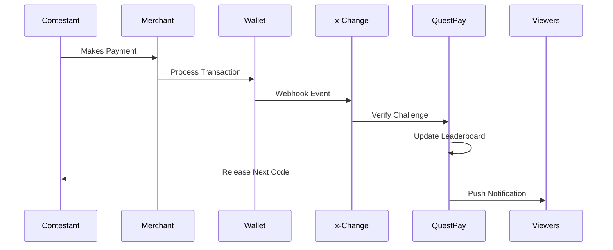

# Real-Time Elements

---

## Overview

QuestPay™ leverages real-time data, live tracking, and instant verification to create an engaging, transparent, and interactive experience for contestants, viewers, and sponsors.

---

## Live Dashboards

### Production Control Dashboard

**Purpose**: Monitor all game activity in real-time

**Features**:
- All contestant GPS locations on map
- Transaction feed as they occur
- Challenge completion status
- System health and alerts
- Emergency controls

### Contestant Dashboard

Accessible via QuestPay app or web portal:

- Current position/rank
- Points balance
- Active challenges
- Completed challenges
- Time tracking
- Next steps

### Viewer Dashboard

Public-facing real-time information:

- Leaderboard
- Transaction heat map
- Contestant progress bars
- Live statistics
- Prediction games
- Side quest opportunities

---

## Social Media Integration

### Automated Content Generation

**Transaction Announcements**:
```
"🎯 Maria just paid for lumpia at Quiapo Market! 
Challenge 3 complete! #QuestPayPH"
```

**Milestone Celebrations**:
```
"⚡ Juan is the first to complete 5 challenges! 
Can anyone catch up? #QuestPayPH"
```

**Location Check-ins**:
```
"📍 3 contestants spotted at BGC! 
Something big happening! #QuestPayPH"
```

### Platform Strategy

| Platform | Content Type | Update Frequency |
|----------|--------------|------------------|
| **Twitter/X** | Text updates, quick facts | Every 2-5 minutes |
| **Facebook** | Longer posts, photos | Every 10-15 minutes |
| **Instagram** | Stories, photos | Continuous stories |
| **TikTok** | Short clips, highlights | 3-5 per episode |
| **YouTube** | Live stream, replays | Continuous |

---

## Public Leaderboards

### Display Locations

**Digital Displays**:
- Partner wallet apps (in-app widget)
- QuestPay website
- Partner merchant screens
- Transit advertising screens
- Shopping mall displays

**Broadcast Integration**:
- Picture-in-picture on TV
- Lower-third graphics
- Full-screen updates at breaks
- Mobile app second screen

### Leaderboard Data

| Rank | Contestant | Points | Challenges | Status |
|------|-----------|--------|------------|--------|
| 1 | Maria S. | 850 | 8/10 | 🏃 Active |
| 2 | Juan D. | 825 | 8/10 | 🏃 Active |
| 3 | Ana R. | 800 | 7/10 | ⏸️ Planning |

---

## Live Verification System

### Transaction Verification Flow



### Verification Speed

- **Target**: < 5 seconds from transaction to verification
- **Typical**: 2-3 seconds
- **Fallback**: Manual verification within 2 minutes if API fails

---

## Audience Interaction

### Live Voting

**Vote Types**:
- Predict next challenge winner
- Choose contestant advantages
- Select bonus challenge types
- Vote for viewer favorite

**Implementation**:
- In-app polling
- Social media polls
- SMS voting
- Website forms

### Live Chat & Comments

**Moderated Channels**:
- YouTube live chat
- Facebook live comments
- Dedicated Discord server
- Twitter hashtag feeds

**Features**:
- Auto-moderation for profanity
- Highlighted super chats/donations
- Producer Q&A sessions
- Contestant shout-outs

---

## Smart Contracts & Transparency

### Blockchain Anchoring (Optional)

For maximum transparency and trust:

**What Gets Recorded**:
- Challenge completion hashes
- Transaction verification proofs
- Prize distribution records
- Audit trail

**Benefits**:
- Tamper-proof records
- Public verifiability
- Sponsor confidence
- Regulatory compliance

### API-Based Verification

Standard implementation using x-Change platform:

- Real-time webhooks
- Transaction logging
- Audit reports
- Compliance exports

---

## Emergency Protocols

### System Failures

**Contingency Plans**:

1. **API Downtime**: Manual verification with photo evidence
2. **Network Issues**: Offline mode with later sync
3. **Contestant Phone Failure**: Backup device provided
4. **Wallet Service Outage**: Challenge pause or alternative methods

### Safety & Security

**Real-Time Monitoring**:
- Contestant safety check-ins
- GPS tracking for emergencies
- Production crew proximity
- Security personnel on standby

**Emergency Contacts**:
- 24/7 hotline for contestants
- Medical support on call
- Police coordination
- Parent/family contacts

---

## Analytics & Insights

### Real-Time Metrics

**For Production**:
- Viewer engagement rates
- Social sentiment analysis
- Transaction volume
- Challenge completion times
- Drop-off points

**For Sponsors**:
- Brand mention frequency
- Merchant visit rates
- Transaction attribution
- Social media reach
- ROI calculations

---

[← Back to Game Mechanics](mechanics.md) | [Continue to Technology →](technology.md)
