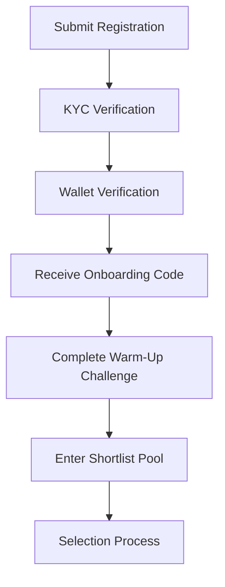

# Participant Recruitment & Onboarding

---

## National Call to Join

### Multi-Channel Launch Campaign

QuestPay™ participant recruitment leverages both traditional broadcast media and digital platforms to maximize reach across all demographics.

#### Broadcast Media

- **Television**: Prime-time commercial spots announcing open registration
- **Radio**: Regional stations with call-to-action messaging
- **Out-of-Home**: Billboards, transit ads, digital screens in high-traffic areas

#### Digital Platforms

| Platform | Target Audience | Content Type |
|----------|----------------|--------------|
| **Facebook** | 25-55 years old | Video teasers, registration links, community groups |
| **TikTok** | 16-30 years old | Short-form challenge videos, influencer partnerships |
| **YouTube** | All ages | Long-form explainers, testimonials, how-to guides |
| **Instagram** | 18-40 years old | Visual storytelling, contestant spotlights, stories |
| **Google Display** | Intent-driven | Retargeting, search ads, display banners |

### Campaign Messaging

**Primary Tagline**: *"Turn your payments into an adventure—join QuestPay™!"*

**Key Messages**:

- Anyone with a mobile wallet can compete
- Real prizes, real challenges, real fun
- Test your skills and strategy
- Be part of fintech history
- No special equipment needed—just your phone and wallet

---

## Digital Sign-Up Portal

### Registration Platform

**Primary URL**: `questpay.ph/join` (or market-specific domain)

**Integration Options**:

- Standalone web portal
- Partner wallet in-app registration
- Social media instant forms
- SMS-based registration for feature phones

### Registration Requirements

Applicants must provide:

1. **Personal Information**
   - Full name (as per valid ID)
   - Date of birth (18+ requirement)
   - Contact number
   - Email address
   - Home address (city/province)

2. **Partner Wallet Account**
   - Verified mobile wallet account number
   - Wallet provider selection (Maya, GCash, etc.)
   - Account verification status

3. **Application Materials**
   - Short video (30-60 seconds) or written statement (200 words)
   - Why you want to join QuestPay™
   - Your unique skills or perspective
   - Social media handles (optional)

4. **Legal Consents**
   - Terms and conditions
   - Privacy policy acknowledgment
   - KYC verification consent
   - Media release for filming
   - Age and eligibility confirmation

### Data Privacy & Security

- **Compliance**: Full adherence to Data Privacy Act
- **Encryption**: All personal data encrypted at rest and in transit
- **Storage**: Secure cloud infrastructure with access controls
- **Retention**: Data kept only as long as necessary for program purposes
- **Rights**: Users can request access, correction, or deletion

---

## Onboarding & Initial Code Distribution

### The Onboarding Flow

### Step 1: Registration Confirmation

Upon successful registration:

- Immediate email/SMS confirmation
- Registration number assigned
- Estimated timeline for next steps
- Link to FAQs and preparation tips

### Step 2: KYC Verification

Powered by partner wallet's existing KYC:

- Leverage wallet provider's verified user data
- Additional checks if required by local regulations
- Automated verification where possible
- Manual review for edge cases

**Timeline**: 1-3 business days

### Step 3: Onboarding Code Issuance

Each participant receives a unique **QuestPay Onboarding Code**:

**Delivery Method**:

- QR code via email
- Deep link via SMS
- In-app notification (if partner wallet integration)

**Code Purpose**:

- Verification of official entry
- Access to pre-game tutorial
- Gateway to warm-up challenge
- Unique identifier for tracking

### Step 4: Warm-Up Challenge

A simple introductory task to familiarize participants with the game mechanics:

**Sample Warm-Up Challenges**:

- Donate ₱10 to featured charity
- Top-up mobile load
- Pay for digital content
- Share campaign video on social media
- Complete financial literacy quiz

**Benefits**:

- Tests technical setup
- Confirms wallet functionality
- Teaches basic mechanics
- Filters out inactive registrants
- Creates early engagement

**Verification**: Automatic via API webhook from partner wallet

### Step 5: Shortlist Entry

Participants who complete the warm-up challenge are automatically entered into the shortlist pool for final selection.

**Shortlist Criteria**:

- Warm-up challenge completion ✓
- KYC verification passed ✓
- Wallet active and functional ✓
- Media release signed ✓
- Geographic distribution balanced ✓

---

## Selection & Announcement

### Selection Process

QuestPay™ uses a hybrid selection methodology to ensure fair,  diverse, and engaging contestant lineup.

#### Scoring Components

| Component | Weight | Description |
|-----------|--------|-------------|
| **Verified Tasks** | 30% | Warm-up challenge completion and quality |
| **Social Engagement** | 25% | Shares, reactions, video views |
| **Application Quality** | 25% | Video/written statement creativity and appeal |
| **Diversity Factors** | 10% | Geographic, demographic, background balance |
| **Random Draw** | 10% | Element of chance for fairness |

#### Diversity Considerations

To ensure broad representation:

- **Geographic**: Balance across urban, suburban, and rural
- **Age**: Mix of generations (18-25, 26-40, 41+)
- **Gender**: Equitable representation
- **Occupation**: Students, professionals, entrepreneurs, etc.
- **Wallet Experience**: Mix of power users and newbies

### Announcement Process

**Phase 1: Semi-Finalists**

- Top 50-100 applicants notified
- Invited to virtual or in-person audition
- Background checks initiated

**Phase 2: Finals**

- Auditions conducted (video or in-person)
- Producers evaluate on-camera presence
- Final 20-50 contestants selected

**Phase 3: Public Launch**

- Contestants announced via social media
- Press release issued
- Contestant profiles published
- Pre-show promotional content begins

### Confirmation Code

Selected contestants receive a **QuestPay Contestant Code** that:

- Activates their official profile
- Grants access to contestant portal
- Enables participation in the competition
- Links to production schedule and logistics

---

## Audience Participation

### Side Player Program

Viewers who register but aren't selected as main contestants can become **Side Players**:

**Side Player Benefits**:

- Participate in parallel challenges
- Earn points and small rewards
- Predict contestant outcomes
- Influence some game elements via voting
- Qualify for special prizes

**Side Player Challenges**:

- Complete same challenges as contestants (at home)
- Brand-sponsored tasks (follow, share, purchase)
- Financial literacy quizzes
- Charity donation drives
- Referral programs

### Viewer Engagement Tiers

| Tier | Requirements | Rewards |
|------|--------------|---------|
| **Observer** | Watch the show | Entertainment |
| **Side Player** | Register + 1 challenge | Points, badges |
| **Active Player** | 5+ challenges | Prizes, leaderboard |
| **Super Player** | Top 100 weekly | Premium rewards, exclusive content |

### Expanding the Ecosystem

By enabling audience participation:

- **Expands engagement** beyond just contestant storylines
- **Increases transaction volume** for sponsor ROI
- **Builds community** of engaged fans
- **Generates data** on user behavior and preferences
- **Creates pipeline** for future season contestants

---

## Registration Timeline

### Pre-Launch (Week -4 to -1)

- Teaser campaign begins
- Landing page goes live
- Partner wallet integration tested
- Media partnerships activated

### Launch Week (Week 0)

- Major announcement across all channels
- Registration portal opens
- Influencer partnerships activate
- Early applicants featured

### Registration Period (Week 1-3)

- Continuous promotion
- Weekly application milestones shared
- Community building on social media
- Partner wallet promotions

### Shortlisting (Week 4-5)

- Registration closes
- Warm-up challenges deployed
- Verification process runs
- Shortlist compiled

### Selection (Week 6-7)

- Auditions conducted
- Final contestants chosen
- Contracts signed
- Training begins

### Pre-Show Promotion (Week 8-10)

- Contestant reveals
- Trailer and teasers
- Partner activation begins
- Hype building

---

[← Back to Format Options](format.md) | [Continue to Selection Process →](selection.md)
