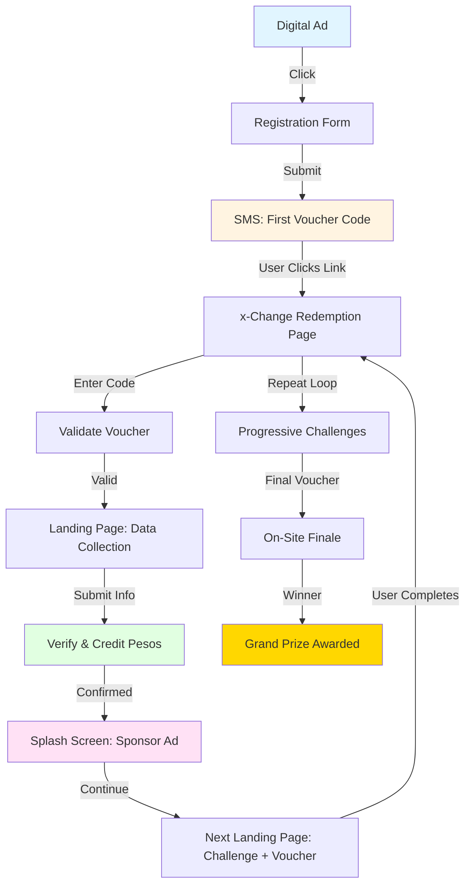

# Sample Episode Walkthrough

---

## Overview

This document demonstrates a **real-world contestant journey** through a QuestPay™ challenge, showcasing the redemption flow, x-Change voucher mechanics, sponsor integration, and data collection capabilities.

**Use Case**: Investor pitch demonstrating technical implementation and sponsor ROI

---

## Episode: "The Metro Manila Sprint"

**Theme**: Urban exploration and financial literacy  
**Duration**: 3-hour live challenge  
**Contestants**: 10 active participants  
**Audience**: Thousands of passive viewers tracking progress  
**Primary Sponsor**: Digital bank (e.g., UnionBank, BDO, or Maya)  
**Secondary Sponsors**: Quick-service restaurants, retail brands, transportation apps

---

## Contestant Journey Flow

### Phase 1: Registration & Entry

#### Step 1: Discovery (Digital Ad)

**Channel**: Facebook/Instagram sponsored post

**Ad Creative**:
> 🏃‍♂️ **Race for ₱50,000!**  
> Complete challenges across Metro Manila, redeem vouchers, and compete for the grand prize.  
> **Start your quest now →**

**Call to Action**: "Join the Race" button

---

#### Step 2: Registration Form

User clicks and lands on registration page with form:

**Required Fields**:
- Mobile Number (primary identifier)
- First Name
- Age Range (18-25, 26-35, 36-45, 46+)
- City/Municipality
- Consent to terms and data privacy policy

**Submit Button**: "Start My Quest"

---

#### Step 3: Initial SMS Voucher

**Immediately upon submission**, contestant receives SMS:

```
🎮 Welcome to QuestPay™!

You're registered for The Metro Manila Sprint!

Your first voucher code: QP-START-8X2K9

Redeem at: questpay.ph/redeem

The race begins in 30 minutes. Get ready!

- QuestPay Team
```

---

### Phase 2: Challenge 1 – First Redemption

#### Step 4: Voucher Redemption

Contestant visits: `questpay.ph/redeem` or clicks SMS link

**Redemption Screen** (x-Change splash page):

> **QuestPay™ – Metro Manila Sprint**  
> 
> Welcome, Racer!  
> 
> Enter your voucher code to begin your quest.
> 
> [Input field: Voucher Code]  
> [Button: REDEEM]

Contestant enters: `QP-START-8X2K9`

---

#### Step 5: Data Collection & Verification

Upon successful code validation, **x-Change landing page** appears:

**Heading**: "Complete Your Profile to Unlock ₱100"

**Form Fields**:
- Full Name
- Complete Address (Street, Barangay, City, ZIP)
- Email Address
- Photo Upload: "Take a selfie at your starting location"
- GPS Location Capture (automatic with consent)
- Digital Signature: "I agree to participate in QuestPay™"

**Submit Button**: "Claim My ₱100"

---

#### Step 6: Pesos Credited

**Confirmation Screen** (x-Change):

> ✅ **Verified!**  
> 
> ₱100 has been credited to your account.  
> 
> **Next Challenge Unlocks in 5 minutes...**
> 
> [Loading animation]

---

### Phase 3: Challenge 2 – Sponsor Activation

#### Step 7: Splash Screen (Ad)

After 5 seconds, **splash screen appears** with sponsor message:

> **Powered by UnionBank Digital Banking**  
> 
> 💳 Open your account in 5 minutes  
> Get ₱200 welcome bonus  
> 
> [Sponsor logo + branding]  
> 
> [Button: Continue to Next Challenge →]

**Analytics Captured**:
- Impression (view)
- Time on screen
- Click-through (if button clicked)

---

#### Step 8: Landing Page with Next Instruction

Contestant is redirected to **branded landing page**:

**Page Header**: "Challenge 2: The Knowledge Sprint"

**Sponsor Section**: UnionBank Digital Banking promotional content

**Challenge Content**:

> **Answer this financial literacy question to unlock your next voucher:**
> 
> **Question**: What does "APR" stand for in banking?  
> A) Annual Percentage Rate  
> B) Account Protection Rate  
> C) Automatic Payment Reminder  
> D) Asset Purchase Ratio
> 
> [Multiple choice selection]

**Submit Answer** → If correct:

> ✅ **Correct!**  
> 
> Your next voucher code is: **QP-MOVE-7F4L2**  
> 
> **Next Challenge**: Redeem this code at Jollibee Taft Avenue within 30 minutes to unlock ₱150!  
> 
> [Map showing location]  
> [Button: Navigate Now]

---

### Phase 4: Challenge 3 – Physical Location Check-In

#### Step 9: On-Location Redemption

Contestant arrives at **Jollibee Taft Avenue** and redeems voucher code: `QP-MOVE-7F4L2`

**x-Change Landing Page**:

**Heading**: "Challenge 3: Fuel Your Race!"

**Instructions**:
> You've arrived at Jollibee! Complete this challenge to earn ₱150.
> 
> **Tasks**:
> 1. Take a photo of your Jollibee meal
> 2. Share a 10-second video on your social media with #QuestPayRace
> 3. Verify your location

**Form Fields**:
- Photo Upload (meal)
- Video Upload or Social Media Link
- GPS Location (auto-capture)
- Optional: Tag 3 friends who should join next season

**Submit Button**: "Complete Challenge"

---

#### Step 10: Pesos Credited + Next Voucher

**Confirmation Screen**:

> ✅ **Challenge Complete!**  
> 
> ₱150 credited to your account.  
> 
> **Total Earned**: ₱250  
> **Rank**: 3rd place (out of 10)  
> 
> [Live Leaderboard Display]

**Splash Screen** (Jollibee Ad):

> **Jollibee Presents: The QuestPay Sprint**  
> 
> 🍗 Langhap-Sarap fuels champions!  
> Visit Jollibee and get 20% off with code: QUESTPAY20  
> 
> [Button: Next Challenge →]

---

#### Step 11: Progressive Challenge Loop

**Next Landing Page**:

> **Challenge 4: The Transit Test**
> 
> **Sponsored by Grab**
> 
> Use Grab to reach your next destination: **SM Mall of Asia**  
> 
> Your next voucher code: **QP-RIDE-3N8V5**  
> 
> Redeem at MOA to unlock your next challenge!  
> 
> ⏱️ Time Limit: 45 minutes  
> 
> [Button: Book Grab Now] (deep link to Grab app)

**Pattern Repeats**:
- Voucher redemption
- Landing page with sponsor content
- Data collection or gamification
- Pesos credited
- Splash screen (ad)
- Next voucher revealed

---

### Phase 5: Final Challenge & Grand Prize

#### Step 12: Finale Location

After 5-7 challenges, top 3 contestants receive **final voucher** via SMS:

```
🏆 FINAL CHALLENGE!

You're in the TOP 3!

Report to Rizal Park Grandstand NOW to compete for ₱50,000!

Your finale voucher: QP-FINAL-X9R2Z

Hurry - first to complete wins!
```

---

#### Step 13: On-Site Finale

Contestants redeem finale voucher at **physical event location**:

**x-Change Landing Page**:

> **🏁 FINAL CHALLENGE**
> 
> Complete this obstacle course and trivia challenge to win!
> 
> **Tasks**:
> 1. Complete physical challenge (timed)
> 2. Answer 5 rapid-fire questions
> 3. Submit your completion photo
> 
> **First to finish correctly wins ₱50,000!**

---

## Technical Flow Diagram



---

## Sponsor Integration Points

### Data Collected Per Challenge

| Data Type | Purpose | Sponsor Benefit |
|-----------|---------|-----------------|
| **Demographics** | Name, age, location | Audience profiling |
| **Photos** | Selfies, product shots | User-generated content |
| **GPS Location** | Check-ins at merchant sites | Foot traffic verification |
| **Social Shares** | Videos, tags, posts | Viral amplification |
| **Behavioral** | Time on page, clicks | Engagement metrics |
| **Trivia Answers** | Financial literacy quiz | Educational impact measurement |
| **Contact Info** | Email, phone | Lead generation for follow-up campaigns |

---

## Sponsor Touchpoints & ROI

### Per Episode Metrics (10 Contestants, 5 Challenges Each)

| Touchpoint | Quantity | Sponsor Value |
|------------|----------|---------------|
| **Splash Screen Impressions** | 50+ (5 per contestant) | Brand awareness |
| **Landing Page Views** | 50+ | Deep engagement (avg 30-60 sec) |
| **Photo/Video UGC** | 30+ pieces | Social proof content |
| **GPS Check-ins** | 50+ | Foot traffic validation |
| **Lead Captures** | 10 full profiles | CRM database growth |
| **Social Media Reach** | 10K-100K+ impressions | Viral amplification via contestant networks |

### Example Sponsor ROI

**UnionBank Digital Banking Activation**:
- **Investment**: ₱200K (title sponsor for episode)
- **Reach**: 50K+ social impressions
- **Leads**: 10 contestant profiles + 1,000+ viewer sign-ups
- **UGC**: 20+ branded photos/videos
- **Cost per Lead**: ~₱200 (highly qualified, engaged audience)
- **Brand Recall**: 100% (contestants repeatedly exposed during episode)

---

## Why This Works for Investors

### 1. **Clear Technical Demonstration**
Shows x-Change voucher platform capabilities:
- Progressive code unlocking
- Rich landing pages with data collection
- Real-time validation and disbursement
- Sponsor ad integration

### 2. **Measurable Sponsor Value**
Every touchpoint is tracked and quantifiable:
- Impressions, clicks, time-on-page
- Lead generation and CRM growth
- Foot traffic verification
- User-generated content

### 3. **Scalable Mechanics**
Same flow works for:
- 10 contestants or 1,000
- Single city or nationwide
- 3-hour sprint or multi-day quest
- Any sponsor category

### 4. **Revenue Model Clarity**
Shows how sponsors pay for:
- Splash screen placements (₱20K-50K each)
- Landing page activations (₱50K-200K)
- Voucher generation fees (₱5-50 per code depending on features)
- Data collection and analytics

### 5. **Non-Regulated Revenue**
All voucher activity generates revenue **without BSP float restrictions** or traditional MDR dependencies.

---

## Next Steps for Investors

### To Experience This Flow Live

1. **Request a demo**: We can set up a test challenge with your team as contestants
2. **Review analytics dashboard**: See real-time data capture and reporting
3. **Customize for your portfolio**: Adapt episode themes to your investment thesis
4. **Pilot production budget**: Review Phase 1 funding requirements ($450K-750K)

---

## Sample Episode Variations

We can create similar walkthroughs for:

- **Corporate B2B**: Team-building challenge for company employees
- **Tourism Campaign**: Regional destination discovery quest
- **Product Launch**: Brand activation for new consumer product
- **Bank Onboarding**: Financial inclusion challenge for unbanked populations
- **Charity Fundraiser**: Cause-driven quest with matching donations

[Contact us to request custom episode scripts →](nextsteps.md)

---

[← Back to Production Plan](production.md) | [Continue to Next Steps →](nextsteps.md)
