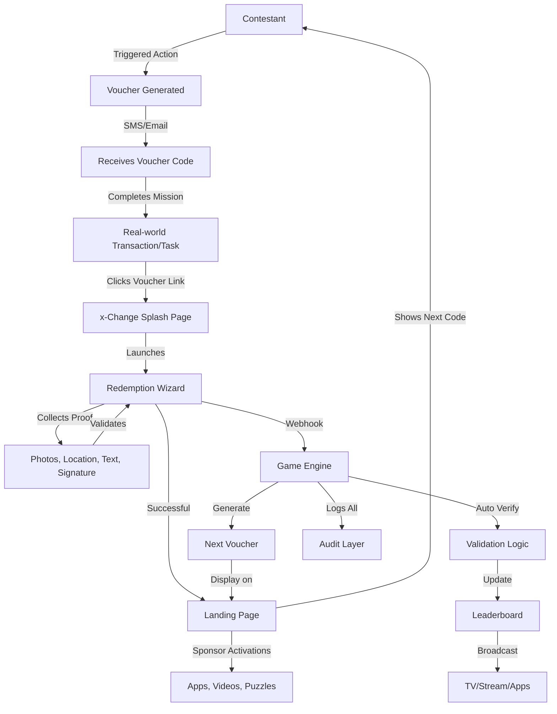

# Technology: System Architecture

---

## System Architecture Overview

QuestPay™ is built on a layered architecture integrating voucher technology, payment systems, game logic, and broadcast tools.

---

## Core Components

### 1. x-Change Voucher Engine

**Purpose**: Issues, redeems, and validates QuestPay voucher codes with rich interactive redemption flows

**Core Capabilities**:
- Generate unique voucher codes with optional QR representation
- Validate and redeem codes via web or API
- Configurable splash pages with custom messaging
- Dynamic landing page redirects for data collection
- Track complete voucher lifecycle and redemption history

**Redemption Features**:
- **Multi-Channel Notifications**: Email, SMS, and webhook delivery
- **Interactive Landing Pages**: Collect text, photos, signatures, location, KYC data
- **Survey-like Forms**: Custom input fields for challenge-specific data
- **Media Upload**: Photo and video proof submission
- **GPS Tracking**: Location verification and check-ins
- **Digital Signatures**: Capture contestant acknowledgments
- **Real-time Validation**: Immediate feedback on submissions
- **Progressive Disclosure**: Display next voucher code upon completion

**Technology Stack**:
- Laravel PHP framework
- PostgreSQL database
- Redis for caching
- RESTful API
- Responsive web interface

### 2. QuestPay Game Layer

**Purpose**: Game logic, challenge management, and contestant tracking

**Capabilities**:
- Challenge configuration and deployment
- Contestant registration and management
- Real-time scoring and leaderboards
- Rule engine for verification
- Admin dashboard for producers

**Technology Stack**:
- Node.js / Python backend
- React/Vue.js frontend
- MongoDB for flexible game data
- WebSocket for real-time updates

### 3. Partner Wallet API Integration

**Purpose**: Connect to payment providers for transaction verification

**Partners**:
- Maya
- GCash
- UnionBank
- BDO
- Other EMI-licensed wallets

**Integration Method**:
- Webhook callbacks on transactions
- OAuth 2.0 authentication
- Transaction verification API
- Balance inquiry (if needed)

### 4. Live Broadcast / App Layer

**Purpose**: UI for contestants, viewers, and producers

**Components**:

**Contestant App** (Mobile):
- Code scanner
- Challenge instructions
- Progress tracking
- Navigation/maps

**Viewer App** (Mobile/Web):
- Live leaderboard
- Transaction feed
- Prediction games
- Side quests

**Production Dashboard** (Web):
- Real-time monitoring
- Challenge deployment
- Emergency controls
- Analytics

### 5. Audit & Analytics Layer

**Purpose**: Transaction traceability, compliance, and insights

**Features**:
- Complete audit trail
- Compliance reporting
- Performance analytics
- Fraud detection
- Export capabilities

**Options**:
- Blockchain anchoring (optional)
- API-based logging (standard)
- Third-party audit integration

---

## System Flow Diagram



---

## Security & Compliance

### Data Security

**Encryption**:
- TLS 1.3 for all API communications
- AES-256 for data at rest
- Code generation using cryptographic randomness

**Access Control**:
- Role-based access control (RBAC)
- Multi-factor authentication for admins
- API key rotation
- Audit logging of all access

### Compliance Framework

**AML/KYC**:
- Leverage partner wallet KYC
- Transaction monitoring
- Suspicious activity flagging
- Regulatory reporting

**Data Privacy**:
- GDPR/PDPA compliance
- User consent management
- Right to access/deletion
- Anonymization for analytics

**EMI License Requirements**:
- Operate within partner EMI perimeter
- No direct handling of funds
- Voucher-based value transfer
- Regulatory alignment

### BSP Circular Alignment

Operating in Philippines requires compliance with:
- BSP Circular No. 1108 (E-Money Issuers)
- BSP Circular No. 980 (Financial Consumer Protection)
- Data Privacy Act of 2012
- Anti-Money Laundering Act

**Compliance Strategy**:
- Partner with licensed EMI
- Regular compliance audits
- Documentation and reporting
- Legal counsel oversight

---

## Infrastructure

### Cloud Platform

**Recommended**: AWS or Google Cloud Platform

**Services Used**:
- Compute: EC2 / Cloud Run
- Database: RDS (PostgreSQL) / Cloud SQL
- Cache: ElastiCache (Redis)
- Storage: S3 / Cloud Storage
- CDN: CloudFront / Cloud CDN

### Scaling Strategy

| Component | Scaling Method | Expected Load |
|-----------|---------------|---------------|
| **API** | Horizontal (load balanced) | 1000 req/sec peak |
| **Database** | Vertical + read replicas | 10k transactions/day |
| **WebSocket** | Horizontal (sticky sessions) | 10k concurrent connections |
| **Storage** | Auto-scaling | 1TB media + logs |

### Monitoring & Observability

**Tools**:
- Application monitoring: New Relic / Datadog
- Log aggregation: ELK Stack / CloudWatch
- Uptime monitoring: Pingdom / UptimeRobot
- Error tracking: Sentry

**Alerts**:
- API response time > 1 second
- Error rate > 1%
- Database connection issues
- Wallet API failures

---

## API Architecture

### x-Change API Endpoints

```
POST /api/vouchers/create
POST /api/vouchers/redeem
GET  /api/vouchers/{code}/status
POST /api/webhooks/transaction
```

### QuestPay Game API

```
POST /api/challenges/deploy
GET  /api/contestants/{id}/progress
GET  /api/leaderboard
POST /api/verification/manual
```

### Partner Wallet Webhooks

```
POST /webhook/transaction-complete
POST /webhook/payment-failed
POST /webhook/refund-processed
```

---

## Development & Testing

### Development Environment

- Local Docker setup
- Sandbox wallet APIs
- Test data generators
- Mock transaction webhooks

### Testing Strategy

**Unit Tests**:
- Code validation logic
- Scoring calculations
- Business rules

**Integration Tests**:
- Wallet API integration
- Webhook processing
- End-to-end flows

**Load Tests**:
- Concurrent contestant simulation
- Transaction volume testing
- Real-time update performance

---

## Disaster Recovery

### Backup Strategy

- **Database**: Automated daily backups, 30-day retention
- **Files**: Replicated across regions
- **Code**: Git version control + CI/CD
- **Configuration**: Infrastructure as Code

### Recovery Time Objectives

| Component | RTO | RPO |
|-----------|-----|-----|
| **API** | < 15 minutes | 0 (stateless) |
| **Database** | < 1 hour | < 5 minutes |
| **Contestant Data** | < 30 minutes | 0 (real-time replication) |

---

[← Back to Real-Time Elements](realtime.md) | [Continue to Security & Compliance →](compliance.md)
